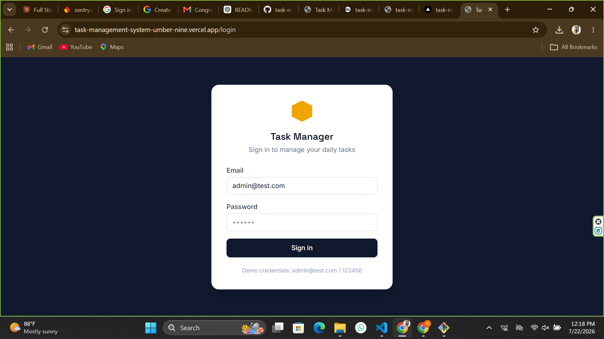
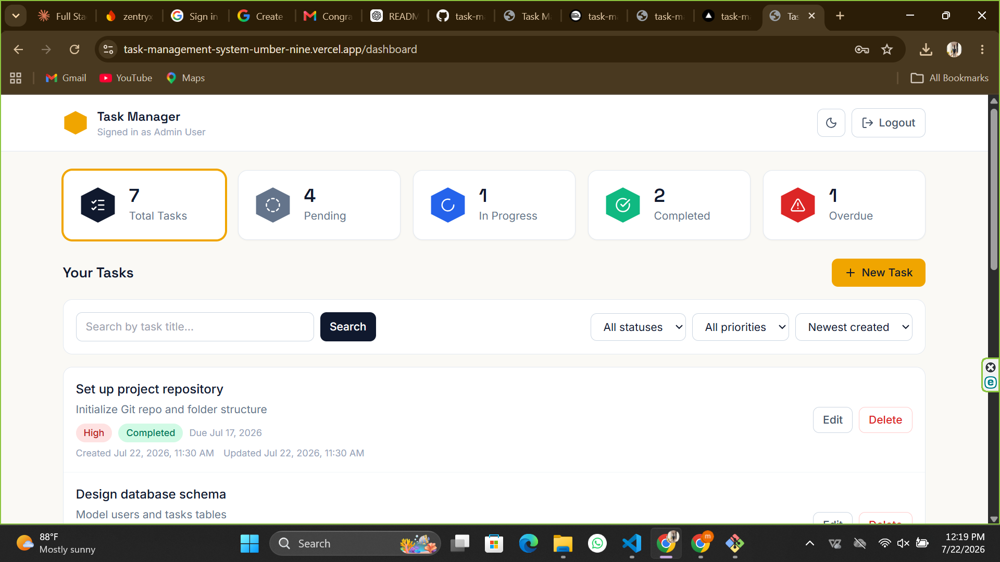
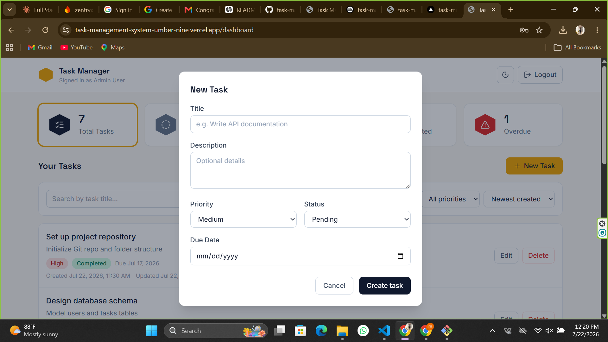

# Task Management System

A full-stack Task Management System built for the Koncepthive Full Stack Web Developer
Intern technical assessment. Users log in, see a dashboard summary of their tasks, and
create, edit, delete, search, filter, and sort tasks.

## Live Demo

### Frontend
https://task-management-system-umber-nine.vercel.app/

### Backend API
https://task-management-system-production-ab96.up.railway.app

### Demo Credentials

**Email:** `admin@test.com`

**Password:** `123456`

## Screenshots

### Login



### Dashboard



### Create & Manage Tasks



## Project Overview

- **Auth**: single seeded user, JWT-based login/logout
- **Dashboard**: total / pending / in-progress / completed / overdue task counts
- **Tasks**: full CRUD with title, description, priority, status, and due date
- **Search**: by task title
- **Filters**: by status and priority, combinable
- **Sorting**: newest created, oldest created, due date
- **Pagination**: server-side, 10 tasks per page
- **Validation**: mirrored on frontend (instant feedback) and backend (source of truth)
- **Responsive**: usable on desktop, tablet, and mobile

## Technology Stack

| Layer     | Choice |
|-----------|--------|
| Frontend  | React.js + TypeScript (Vite), Tailwind CSS, React Router, Axios, react-hot-toast |
| Backend   | Node.js + Express.js + TypeScript |
| Database  | PostgreSQL |
| Auth      | JWT (JSON Web Tokens) |
| Validation| Zod (backend), matching rules on the frontend |

## Project Structure

```
project/
├── frontend/          React + TypeScript client (Vite)
├── backend/            Express + TypeScript API
├── database/
│   ├── schema.sql      Table definitions, enums, triggers, indexes
│   └── seed.sql         Seed user + sample tasks
└── README.md
```

## Prerequisites

- Node.js 18+
- PostgreSQL 13+
- npm

## Database Setup

1. Create the database:
   ```bash
   createdb task_management
   ```
2. Run the schema, then the seed data:
   ```bash
   psql -d task_management -f database/schema.sql
   psql -d task_management -f database/seed.sql
   ```
   This creates the `users` and `tasks` tables and a default login:
   - **Email:** `admin@test.com`
   - **Password:** `123456`

## Environment Variables

### Backend (`backend/.env`)
Copy `backend/.env.example` to `backend/.env` and fill in your local values:

```
PORT=5000
NODE_ENV=development

DB_HOST=localhost
DB_PORT=5432
DB_NAME=task_management
DB_USER=postgres
DB_PASSWORD=postgres

JWT_SECRET=change_this_to_a_long_random_string
JWT_EXPIRES_IN=1d

FRONTEND_URL=http://localhost:5173
```

### Frontend (`frontend/.env`)
Copy `frontend/.env.example` to `frontend/.env`:

```
VITE_API_URL=http://localhost:5000/api
```

## Running the Backend

```bash
cd backend
npm install
npm run dev       # starts on http://localhost:5000 with auto-reload
```

Production build:
```bash
npm run build
npm start
```

## Running the Frontend

```bash
cd frontend
npm install
npm run dev       # starts on http://localhost:5173
```

Production build:
```bash
npm run build     # outputs to frontend/dist
```

Then open `http://localhost:5173` and log in with `admin@test.com` / `123456`.

## Running with Docker (Bonus)

The whole stack (PostgreSQL + backend + frontend) can be started with a single
command — no local Node.js or PostgreSQL install required.

```bash
docker compose up --build
```

This will:
- Start a PostgreSQL 16 container and automatically run `schema.sql` then
  `seed.sql` the first time the database volume is created
- Build and start the backend API on `http://localhost:5000`
- Build and start the frontend (served by nginx) on `http://localhost:5173`

Log in with the same default credentials: `admin@test.com` / `123456`.

To stop everything:
```bash
docker compose down
```

To stop and also wipe the database (fresh start next time):
```bash
docker compose down -v
```

> Note: `docker-compose.yml` uses fixed development credentials
> (`DB_PASSWORD=postgres`, a placeholder `JWT_SECRET`) for convenience. Change
> these in `docker-compose.yml` before deploying anywhere public.

## API Documentation

All endpoints are prefixed with `/api`. Task endpoints require an
`Authorization: Bearer <token>` header obtained from `/auth/login`.

### Auth

| Method | Endpoint | Body | Description |
|--------|----------|------|--------------|
| POST | `/auth/login` | `{ email, password }` | Returns a JWT and user profile |
| POST | `/auth/logout` | — | Stateless no-op for a clean client contract |

### Tasks

| Method | Endpoint | Description |
|--------|----------|--------------|
| GET | `/tasks` | List tasks. Query params: `search`, `status`, `priority`, `sort` (`newest`\|`oldest`\|`due_date`), `page`, `limit` |
| GET | `/tasks/:id` | Get a single task |
| POST | `/tasks` | Create a task. Body: `{ title, description?, priority, status, due_date }` |
| PUT | `/tasks/:id` | Update a task (any subset of the fields above) |
| DELETE | `/tasks/:id` | Delete a task |
| GET | `/tasks/stats/summary` | Dashboard counts: total, pending, inProgress, completed, overdue |

**Example response shape** (`GET /tasks`):
```json
{
  "success": true,
  "data": [ { "id": 1, "title": "...", "priority": "High", "status": "Pending", "due_date": "2026-07-25", "...": "..." } ],
  "pagination": { "page": 1, "limit": 10, "total": 7, "totalPages": 1 }
}
```

## Testing (Bonus)

**Backend** (Jest — validation rules and utility classes):
```bash
cd backend
npm test
```

**Frontend** (Vitest — date/overdue logic):
```bash
cd frontend
npm test
```

## Assumptions Made

- No registration flow is needed — a single seeded admin user is sufficient, as stated
  in the assessment brief.
- "Overdue" is derived, not stored: any task with `due_date` in the past and a status
  other than `Completed` is treated as overdue, both for the dashboard count and the
  badge shown on each task.
- Search matches partial, case-insensitive substrings of the title (`ILIKE '%term%'`).
- Tasks are scoped to the logged-in user's `user_id`, so the data model already supports
  multiple users even though only one exists today.
- Logout is a client-side token removal; since JWTs are stateless there is no server
  session to invalidate (a refresh-token/denylist model would change this).

## Known Limitations

- No registration/password-reset flow (out of scope per the brief).
- No refresh tokens — the JWT simply expires after `JWT_EXPIRES_IN` and the user must
  log in again.
- Unit tests cover validation logic and pure utility functions (dates, error
  handling); there's no integration test suite hitting a real database yet.
- Search only covers title, per the requirement; there's no full-text search across
  descriptions.

## Bonus Features Implemented

- Toast notifications for all create/update/delete/login actions
- Loading and empty states on the task list
- Responsive layout (mobile, tablet, desktop)
- Pagination
- Dark mode with a toggle button (persisted in localStorage)
- Docker support (`docker compose up --build` runs the full stack)
- Unit tests for backend validation/error handling (Jest) and frontend
  date/overdue logic (Vitest)
- Deployed live: frontend on Vercel, backend + PostgreSQL on Railway
  
